---
## Front matter
title: "Отчёт по лабораторной работе №1"
subtitle: "Установка ОС Linux."
author: "Пономарева Варвара Александровна"

## Generic otions
lang: ru-RU
toc-title: "Содержание"

## Bibliography
bibliography: bib/cite.bib
csl: _resources/csl/gost-r-7-0-5-2008-numeric.csl

## Pdf output format
toc: true # Table of contents
toc-depth: 2
lof: true # List of figures
lot: false
fontsize: 12pt
linestretch: 1.5
papersize: a4
documentclass: scrreprt
## I18n polyglossia
polyglossia-lang:
  name: russian
  options:
   - spelling=modern
   - babelshorthands=true
polyglossia-otherlangs:
  name: english
## I18n babel
babel-lang: russian
babel-otherlangs: english
## Fonts
mainfont: Liberation Serif
sansfont: Liberation Sans
monofont: Liberation Mono
mainfontoptions: Ligatures=TeX
romanfontoptions: Ligatures=TeX
sansfontoptions: Ligatures=TeX,Scale=MatchLowercase
monofontoptions: Scale=MatchLowercase,Scale=0.9
## Biblatex
biblatex: true
biblio-style: "gost-numeric"
biblatexoptions:
  - parentracker=true
  - backend=biber
  - hyperref=auto
  - language=auto
  - autolang=other*
  - citestyle=gost-numeric
## Pandoc-crossref LaTeX customization
figureTitle: "Рис."
listingTitle: "Листинг"
lofTitle: "Список иллюстраций"
lolTitle: "Листинги"
## Misc options
indent: true
header-includes:
  - \usepackage{indentfirst}
  - \usepackage{float} # keep figures where there are in the text
  - \floatplacement{figure}{H} # keep figures where there are in the text
---
# Цель работы

Целью данной работы является приобретение практических навыков установки операционной системы на виртуальную машину, настройки минимально необходимых для дальнейшей работы сервисов.

# Задание

Установить на виртуальную машину VirtualBox операционную системы Linux (дистрибутив Fedora).

# Выполнение лабораторной работы

## Установка операционной системы

Называю виртуальную машину sway и выбираю нужный образ ISO. ([рис. @fig-001]).

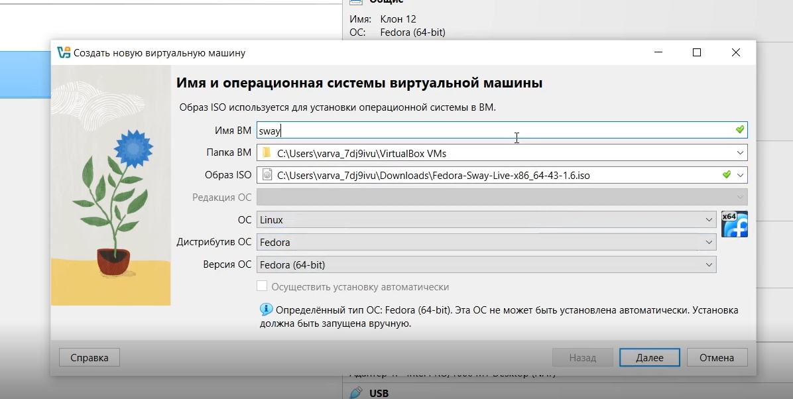{#fig-001 width=70%}

Указываем размер виртуальной памяти, число ЦПУ и размер диска. ([рис. @fig-002]).

{#fig-002 width=70%}

Заходим в расширенные настройки и устанавливаем видеопамять и 3-д ускорение. ([рис. @fig-003]).

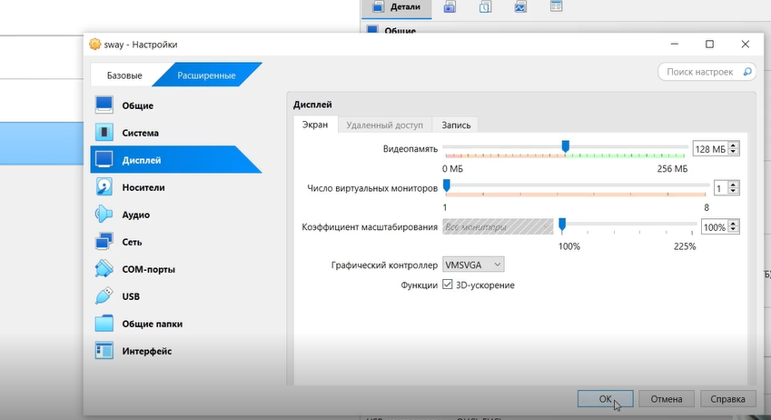{#fig-003 width=70%}

Проверяем как запускается вирутальная машина. ([рис. @fig-004]).

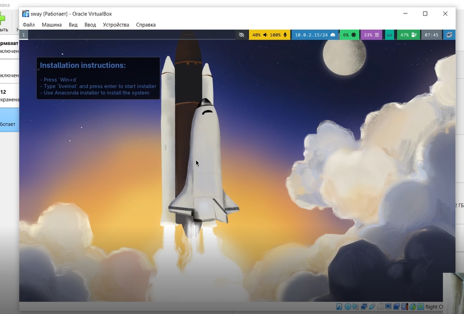{#fig-004 width=70%}

Нажимаю win+d и ввожу liveinst, чтобы начать установку ОС. ([рис. @fig-005]).

{#fig-005 width=70%}

Открывается окно с выбором языка и клавиатуры, делаем выбор. ([рис. @fig-006]).

{#fig-006 width=70%}

Создаем учетную запись и пишем свое имя пользователя в нужном формате, а также подключаем учетную запись root. ([рис. @fig-007]).

{#fig-007 width=70%}

Дожидаемся загрузки и убеждаемся что все в порядке. ([рис. @fig-008]).

{#fig-008 width=70%}

Удаляем в настройках контроллер IDE и изымаем диск из виртуального привода, тк OC уже установлена. ([рис. @fig-009]).

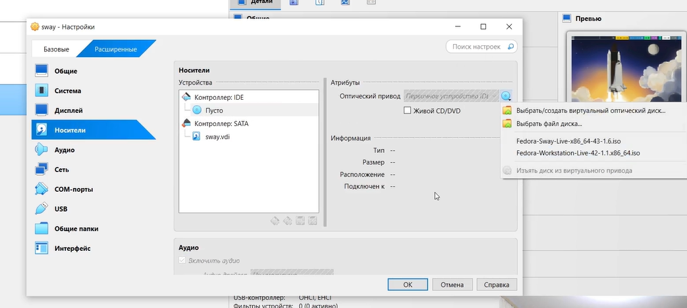{#fig-009 width=70%}

## После установки

Входим под своим именем пользователя и вводим в командной строке sudo -i, чтобы переключиться на роль суперпользователя. ([рис. @fig-010]).

{#fig-010 width=70%}

## Обновления

Установим средства разработки. ([рис. @fig-011]).

{#fig-011 width=70%}

Обновим все пакеты. ([рис. @fig-012]).

{#fig-012 width=70%}

## Повышение комфорта работы

Устанавливаем программы для удобства работы в консоли. ([рис. @fig-013]).

{#fig-013 width=70%}

## Автоматическое обновление

Устанавливаем прогрмааное обеспечение для автоматических обновлений. ([рис. @fig-014]).

{#fig-014 width=70%}

Запускаем таймер. ([рис. @fig-015]).

{#fig-015 width=70%}

## Отключение SELinux

Отключаем SELinux. В файле /etc/selinux/config заменяем значение на  permissive. ([рис. @fig-016]).

{#fig-016 width=70%}

Перезапускаем виртуальную машину. ([рис. @fig-017]).

{#fig-017 width=70%}

## Настройка раскладки клавиатуры

Входим под нужной учетной записью, запускаем мультиплексор tmux и создаем конфигурационный файл. ([рис. @fig-018]).

{#fig-018 width=70%}

Заходим для изменения файла с помощью nano. ([рис. @fig-019]).

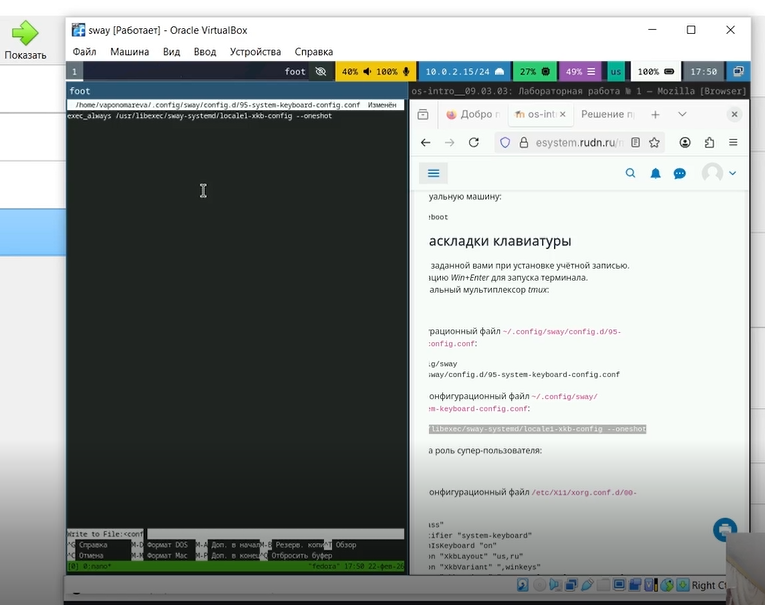{#fig-019 width=70%}

Меняем на нужный текст файла и сохраняем его. ([рис. @fig-020]).

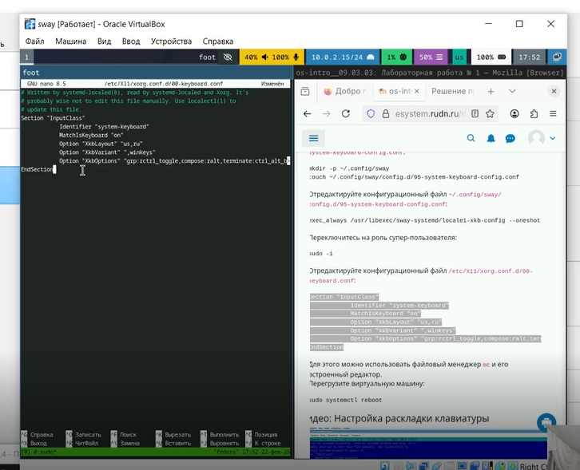{#fig-020 width=70%}

Перезапускаем виртуальную машину. ([рис. @fig-021]).

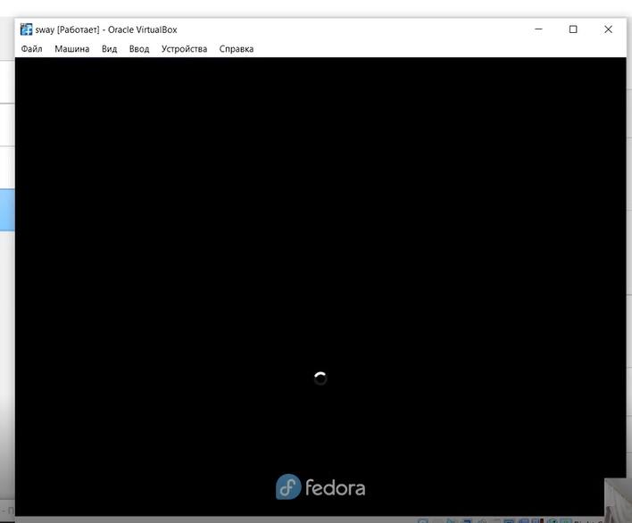{#fig-021 width=70%}

## Настройка раскладки клавиатуры

Входим под нужной учетной записью, запускаем мультиплексор tmux и переключаемся на роль суперпользователя и устанавливаем имя хоста. ([рис. @fig-022]).

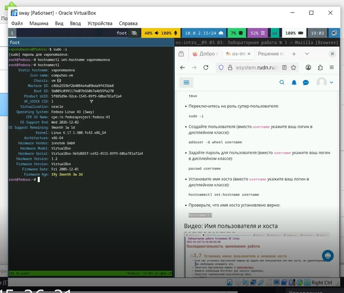{#fig-022 width=70%}

## Установка прогрммного обеспечения для создания документации

Запускаем мультиплексор tmux и переключаемся на роль суперпользователя, устанавливаем pandoc. ([рис. @fig-023]).

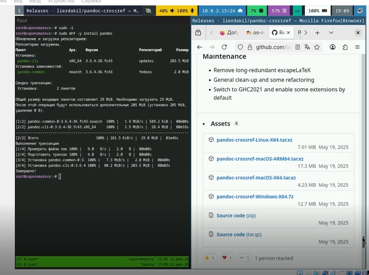{#fig-023 width=70%}

Переходим по ссылке для скачивания pandoc-crossref и ищем нужную сборку с версией. ([рис. @fig-024]).

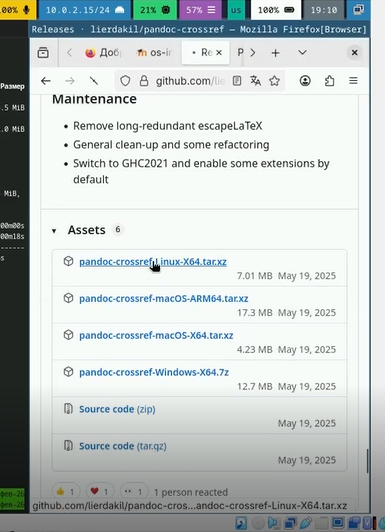{#fig-024 width=70%}

Установка программы и ее распаковка в нужную папку. ([рис. @fig-025]).

{#fig-025 width=70%}

## Texlive

Установим дистрибутив TeXlive. ([рис. @fig-026]).

{#fig-026 width=70%}

## Домашнее задание

В окне терминала проанализируем последовательность загрузки системы, выполнив команду dmesg.([рис. @fig-027]).

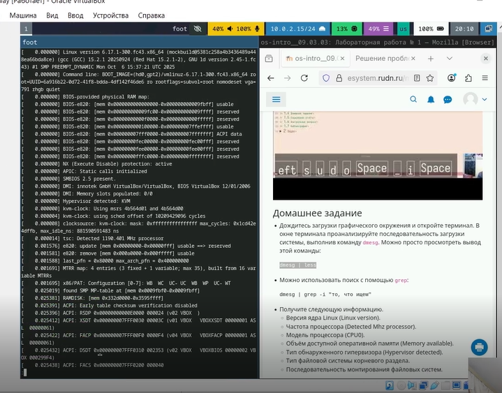{#fig-027 width=70%}

Получаем нужную информацию о виртуальной машине согласно заданию. ([рис. @fig-028]).

{#fig-028 width=70%}

## Контрольные вопросы

1. Какую информацию содержит учётная запись пользователя?

Учетная запись пользователя в Linux хранится в файле /etc/passwd и содержит имя пользователя, уникальный идентификатор пользователя (UID), идентификатор основной группы (GID), реальное имя или описание (GECOS), путь к домашнему каталогу (обычно /home/имя) и командную оболочку (например, /bin/bash). Зашифрованный пароль находится в файле /etc/shadow.

2. Укажите команды терминала и приведите примеры

Основные команды терминала. Для получения справки используется man (например, man ls) или флаг --help (ls --help). Для перемещения по файловой системе — cd: cd /путь/к/папке, cd .. (на уровень выше), cd ~ (в домашнюю папку), cd - (в предыдущую папку). Для просмотра содержимого каталога — ls: ls (простой список), ls -l (подробный), ls -a (со скрытыми), чаще всего ls -la. Для определения объема каталога — du: du -sh /папка (суммарный размер в удобном формате), также можно посмотреть свободное место на дисках командой df -h. Для создания каталогов — mkdir: mkdir ИмяПапки, mkdir -p Папка1/Папка2 (создание вложенных). Для создания файлов — touch: touch файл.txt. Для удаления файлов — rm: rm файл.txt. Для удаления каталогов — rmdir (только пустые) или rm -r Папка (рекурсивно), осторожно с rm -rf. Для задания прав доступа — chmod: можно цифрами, например chmod 755 скрипт.sh (владелец: чт/зап/исп, группа и остальные: чт/исп) или буквами, например chmod u+x файл (добавить исполнение владельцу). Для просмотра истории введенных команд — history.

3. Что такое файловая система? Приведите примеры с краткой характеристикой.

Файловая система — это способ организации и хранения данных на диске, определяющий структуру каталогов, правила именования файлов и механизмы доступа к ним. Она управляет тем, как данные записываются, читаются и как обеспечивается их целостность. Примеры файловых систем: ext4 — стандартная журналируемая ФС для Linux, поддерживает большие файлы и тома, надежна и широко используется; XFS — высокопроизводительная журналируемая ФС, отлично работает с большими файлами и подходит для серверов с высокой нагрузкой; Btrfs — современная ФС с расширенными возможностями: создание снапшотов (мгновенных снимков состояния), встроенное сжатие и проверка целостности данных; NTFS — основная файловая система Windows, поддерживает журналирование и большие тома; FAT32 — простая ФС для съемных носителей, но с ограничением на размер файла не более 4 ГБ; exFAT — улучшенная версия FAT32 без ограничения в 4 ГБ, оптимизирована для флеш-накопителей.

4. Как посмотреть, какие файловые системы подмонтированы в ОС?

Посмотреть подмонтированные файловые системы можно несколькими командами. Команда mount без аргументов выводит полный список всех смонтированных систем с указанием точки монтирования, типа ФС и параметров. Команда findmnt представляет ту же информацию в более структурированном виде (в виде дерева), что удобно для анализа. Команда df -h (disk free) показывает смонтированные разделы, их общий размер, занятое и свободное место в удобном для чтения формате (в мегабайтах или гигабайтах), а также точки монтирования — это самый практичный способ для быстрой оценки использования дискового пространства.

5. Как удалить зависший процесс?

Чтобы удалить зависший процесс, нужно сначала определить его идентификатор (PID). Это делается командами ps aux | grep имя_процесса, pgrep имя_процесса или через top/htop. Затем процессу отправляется сигнал. Стандартный сигнал завершения (SIGTERM) отправляется командой kill PID — программа получает шанс закрыться корректно. Если процесс не реагирует, используется принудительный сигнал (SIGKILL) командой kill -9 PID, который мгновенно останавливает процесс без сохранения данных. Также можно использовать pkill имя_процесса или killall имя_процесса для завершения по имени.

# Выводы

Мы установили на виртуальную машину VirtualBox операционную систему Linux (дистрибутив Fedora).
