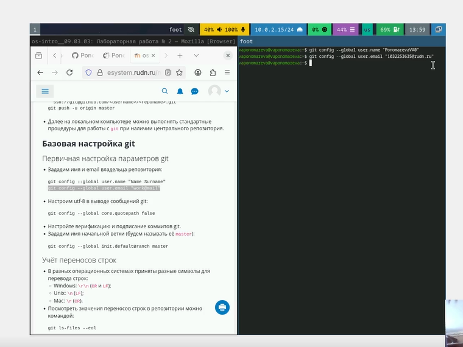
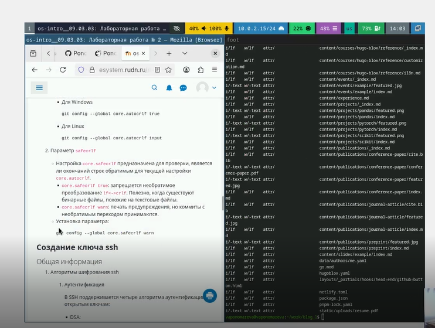
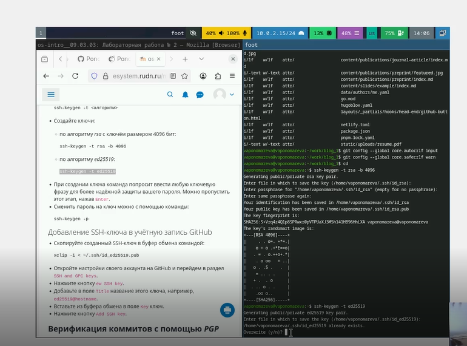
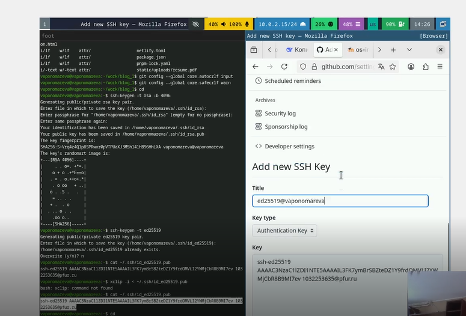
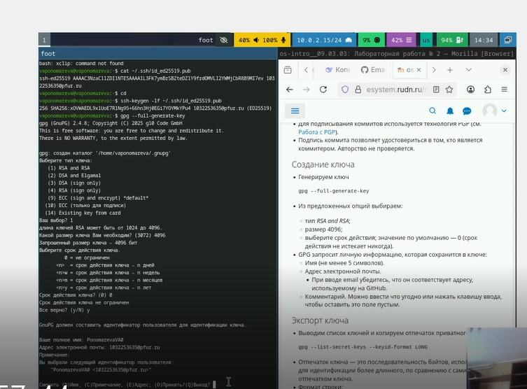
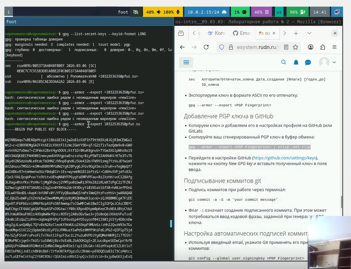
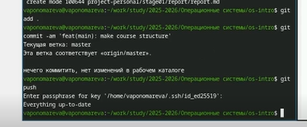

---
## Author
author:
  name: Пономарева Варвара Александровна
  degrees: DSc
  orcid: 0000-0002-0877-7063
  affiliation:
    - name: Российский университет дружбы народов
      country: Российская Федерация
      postal-code: 117198
      city: Москва
      address: ул. Миклухо-Маклая, д. 6
## Title
title: Лабораторная работа №2. Первоначальная настройка git.
license: CC BY
date: today
date-format: "YYYY-MM-DD" # Example: 2025-09-06

## Fonts
mainfont: Liberation Serif
sansfont: Liberation Sans
monofont: Liberation Mono
mainfontoptions: Ligatures=TeX
romanfontoptions: Ligatures=TeX
sansfontoptions: Ligatures=TeX,Scale=MatchLowercase
monofontoptions: Scale=MatchLowercase,Scale=0.9
---

# Информация

## Докладчик

:::::::::::::: {.columns align=center}
::: {.column width="70%"}

  * Пономарева Варвара Александровна
  * студентка группы НПИ бд-02-25

:::
::: {.column width="30%"}

:::
::::::::::::::

# Цель работы

- Изучить идеологию и применение средств контроля версий.Освоить умения по работе с git.

# Задание

- Освоить умения по работе с git и сгенерировать ключи ssh и PGP.

# Базовая настройка git

## Рис.1

- Задаю имя емэил владельца репозитория

## Рис.2

- Настраиваем верификацию и подписание коммитов git и задаем имя начальной ветки, а также utf-8

## Рис.3

- Cмотрим значения переносов строк в репозитории

## Рис.4

- Настраиваем параметры safecrlf и autocrlf

# Создайте ключи ssh

## Рис.5

- Создаем ssh ключ по алгоритму rsa с ключём размером 4096 бит и по алгоритму ed25519

## Рис.6

- Копируем ключ и добавляем его в Github

# Создайте ключи pgp

## Рис.7

- Генерируем ключ pgp и выбираем те значения, которые указаны в тексте

# Добавление PGP ключа в GitHub

## Рис.8

- Выводим список ключей и копируем отпечаток приватного ключа

# Настройка автоматических подписей коммитов git

## Рис.9

- Используя введёный email, укажем Git применять его при подписи коммитов

# Шаблон для рабочего пространства

## Рис.10

- Показываю,что репозиторий был создан в ходе первой лабортаорной работы, что все нужные папки присутствуют и соответствуют шаблону

## Рис.11

- Создаю необходимые каталоги

## Рис.12

- Отправляю файлы на сервер

# Выводы

- Мы освоили умения по работе с git и изучили идеологию и применение средств контроля.

