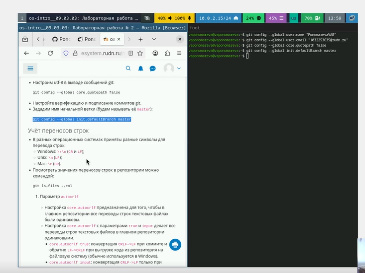
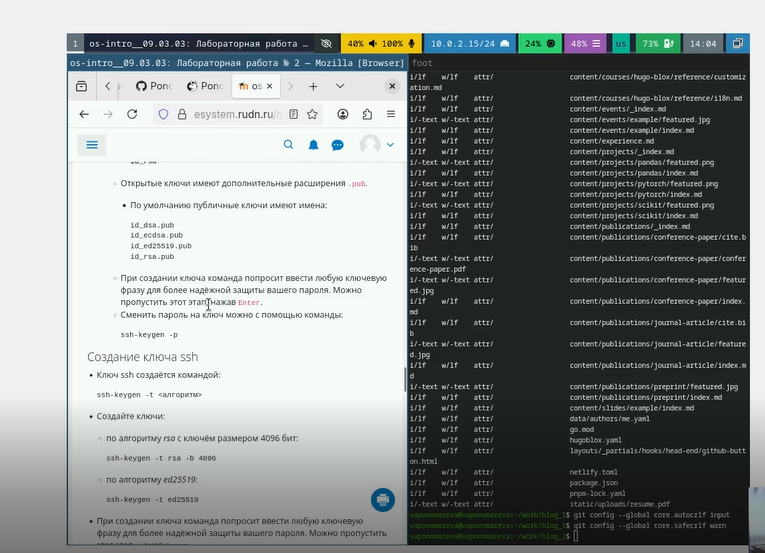
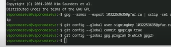
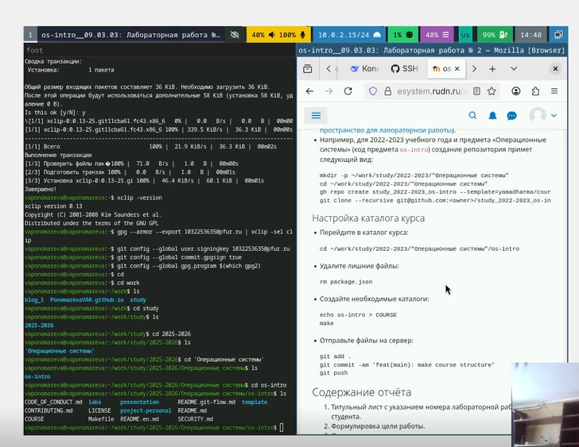
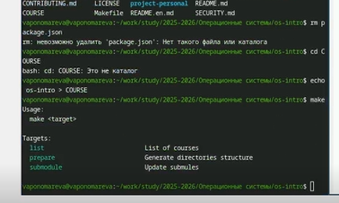

---
## Front matter
title: "Отчёт по лабораторной работе №2"
subtitle: "Первоначальна настройка git."
author: "Пономарева Варвара Александровна"

## Generic otions
lang: ru-RU
toc-title: "Содержание"

## Bibliography
bibliography: bib/cite.bib
csl: _resources/csl/gost-r-7-0-5-2008-numeric.csl

## Pdf output format
toc: true # Table of contents
toc-depth: 2
lof: true # List of figures
lot: false
fontsize: 12pt
linestretch: 1.5
papersize: a4
documentclass: scrreprt
## I18n polyglossia
polyglossia-lang:
  name: russian
  options:
   - spelling=modern
   - babelshorthands=true
polyglossia-otherlangs:
  name: english
## I18n babel
babel-lang: russian
babel-otherlangs: english
## Fonts
mainfont: Liberation Serif
sansfont: Liberation Sans
monofont: Liberation Mono
mainfontoptions: Ligatures=TeX
romanfontoptions: Ligatures=TeX
sansfontoptions: Ligatures=TeX,Scale=MatchLowercase
monofontoptions: Scale=MatchLowercase,Scale=0.9
## Biblatex
biblatex: true
biblio-style: "gost-numeric"
biblatexoptions:
  - parentracker=true
  - backend=biber
  - hyperref=auto
  - language=auto
  - autolang=other*
  - citestyle=gost-numeric
## Pandoc-crossref LaTeX customization
figureTitle: "Рис."
listingTitle: "Листинг"
lofTitle: "Список иллюстраций"
lolTitle: "Листинги"
## Misc options
indent: true
header-includes:
  - \usepackage{indentfirst}
  - \usepackage{float} # keep figures where there are in the text
  - \floatplacement{figure}{H} # keep figures where there are in the text
---
# Цель работы

Изучить идеологию и применение средств контроля версий.Освоить умения по работе с git.

# Задание

Освоить умения по работе с git и сгенерировать ключи ssh и PGP.

# Выполнение лабораторной работы

## Базовая натсройк git

Задаю имя емэил владельца репозитория. ([рис. @fig-001]).

{#fig-001 width=70%}

Настраиваем верификацию и подписание коммитов git и задаем имя начальной ветки, а также utf-8. ([рис. @fig-002]).

{#fig-002 width=70%}

Cмотрим значения переносов строк в репозитории. ([рис. @fig-003]).

{#fig-003 width=70%}

Настраиваем параметры safecrlf и autocrlf. ([рис. @fig-004]).

{#fig-004 width=70%}

## Создайте ключи ssh

Создаем ssh ключ по алгоритму rsa с ключём размером 4096 бит и по алгоритму ed25519. ([рис. @fig-005]).

{#fig-005 width=70%}

Копируем ключ и добавляем его в Github. ([рис. @fig-006]).

{#fig-006 width=70%}

## Создайте ключи pgp

Генерируем ключ pgp и выбираем те значения, которые указаны в тексте. ([рис. @fig-007]).

{#fig-007 width=70%}

## Добавление PGP ключа в GitHub

Выводим список ключей и копируем отпечаток приватного ключа. ([рис. @fig-008]).

{#fig-008 width=70%}

## Настройка автоматических подписей коммитов git

Используя введёный email, укажем Git применять его при подписи коммитов. ([рис. @fig-009]).

{#fig-009 width=70%}

## Шаблон для рабочего пространства

Показываю,что репозиторий был создан в ходе первой лабортаорной работы, что все нужные папки присутствуют и соответствуют шаблону. ([рис. @fig-010]).

{#fig-010 width=70%}

Создаю необходимые каталоги. ([рис. @fig-011]).

{#fig-011 width=70%}

Отправляю файлы на сервер. ([рис. @fig-012]).

{#fig-012 width=70%}

## Контрольные вопросы

1. Что такое системы контроля версий (VCS) и для решения каких задач они предназначаются?

Системы контроля версий — это программные инструменты, которые отслеживают изменения в файлах и позволяют управлять историей этих изменений. Основные задачи VCS включают хранение истории изменений файлов, возможность вернуться к любой предыдущей версии, обеспечение совместной работы нескольких разработчиков над проектом, разрешение конфликтов при одновременном изменении файлов, а также ведение документации о том, кто, когда и какие изменения внес.

2. Объясните следующие понятия VCS и их отношения: хранилище, commit, история, рабочая копия.

Хранилище представляет собой базу данных, где хранятся все файлы проекта и вся история их изменений вместе с метаданными. Commit — это фиксация изменений в хранилище, снимок состояния файлов на определенный момент времени, каждый коммит имеет уникальный идентификатор, автора, дату и комментарий. История — это последовательность коммитов, отражающая эволюцию проекта во времени и позволяющая проследить все изменения. Рабочая копия — это локальная копия файлов проекта из хранилища, с которой непосредственно работает пользователь. Отношения между этими понятиями таковы: пользователь получает рабочую копию из хранилища, вносит изменения, затем создает коммит, который добавляется в историю хранилища.

3. Что представляют собой и чем отличаются централизованные и децентрализованные VCS? Приведите примеры VCS каждого вида.

Централизованные VCS имеют одно центральное хранилище на сервере, все операции требуют подключения к серверу, а рабочая копия содержит только последнюю версию. Примерами таких систем являются CVS, Subversion (SVN) и Perforce. Децентрализованные (распределенные) VCS, напротив, позволяют каждому разработчику иметь полную копию хранилища локально, большинство операций выполняется без подключения к серверу, и можно работать офлайн, синхронизируясь позже. Примерами таких систем служат Git, Mercurial и Bazaar. Главное отличие заключается в том, что в централизованных VCS история хранится только на сервере, а в децентрализованных — у каждого разработчика есть полная копия истории.

4. Опишите действия с VCS при единоличной работе с хранилищем.

При единоличной работе последовательность действий включает создание нового хранилища командой git init, добавление файлов в отслеживание командой git add, фиксацию изменений командой git commit, просмотр истории командой git log, возврат к предыдущим версиям при необходимости с помощью git checkout или git revert, создание веток для экспериментов командой git branch и слияние изменений из веток командой git merge. При единоличной работе нет необходимости синхронизироваться с удаленным сервером, все операции выполняются локально.

5. Опишите порядок работы с общим хранилищем VCS.

При работе с общим хранилищем в команде порядок действий следующий: сначала выполняется клонирование удаленного репозитория командой git clone, затем создается рабочая ветка для новой задачи с помощью git checkout -b, после внесения изменений в рабочую копию они добавляются в индекс командой git add и фиксируются локально командой git commit. Далее необходимо получить актуальные изменения из удаленного репозитория командой git pull, разрешить возможные конфликты, после чего отправить свои изменения в удаленный репозиторий командой git push. Затем создается pull request для ревью кода, и после одобрения выполняется слияние ветки с основной.

6. Каковы основные задачи, решаемые инструментальным средством git?

Git решает следующие основные задачи: отслеживание истории изменений файлов, обеспечение возможности параллельной разработки через ветвление, слияние изменений из разных веток, обеспечение целостности данных с помощью хеш-сумм каждого коммита, работа в распределенном режиме, когда каждый разработчик имеет полную копию репозитория, поддержка нелинейной истории разработки, возможность отмены изменений и возврата к предыдущим состояниям, а также организация совместной работы над проектом без необходимости постоянного подключения к серверу.

7. Назовите и дайте краткую характеристику командам git.

Основные команды Git включают: git init для создания нового локального репозитория, git clone для копирования удаленного репозитория на локальную машину, git add для добавления изменений в индекс перед коммитом, git commit для фиксации изменений в репозитории с комментарием, git status для просмотра состояния рабочей копии и индекса, git log для просмотра истории коммитов, git diff для просмотра различий между версиями, git branch для создания, просмотра и удаления веток, git checkout для переключения между ветками или восстановления файлов, git merge для слияния изменений из одной ветки в другую, git pull для получения изменений из удаленного репозитория, git push для отправки изменений в удаленный репозиторий, git remote для управления подключениями к удаленным репозиториям, git fetch для загрузки изменений из удаленного репозитория без слияния, git reset для отмены изменений или перемещения указателя ветки, git revert для создания нового коммита, отменяющего изменения предыдущего, и git tag для создания меток для важных коммитов, например для обозначения версий.

8. Приведите примеры использования при работе с локальным и удалённым репозиториями.

При работе с локальным репозиторием пример использования выглядит так: сначала создается новый репозиторий командой git init my-project, затем создается файл README.md, добавляется в отслеживание командой git add README.md и фиксируется командой git commit -m "Initial commit". Далее создается ветка для новой функции командой git branch feature-login, выполняется переключение на нее командой git checkout feature-login, после работы над функцией файл login.py добавляется и коммитится, затем осуществляется возврат в основную ветку командой git checkout main и слияние ветки командой git merge feature-login. Просмотр истории выполняется командой git log --oneline. При работе с удаленным репозиторием пример включает клонирование проекта командой git clone, создание новой ветки для задачи git checkout -b bugfix, работу над исправлением с последующим добавлением и коммитом, получение актуальных изменений из основной ветки через git pull origin main, обновление своей ветки через git merge main, отправку изменений на сервер командой git push origin bugfix, создание Pull Request через веб-интерфейс и после слияния удаление локальной ветки командой git branch -d bugfix.

9. Что такое и зачем могут быть нужны ветви (branches)?

Ветви представляют собой указатели на определенные коммиты, позволяющие вести параллельную разработку и создающие изолированное пространство для работы. Ветви необходимы для параллельной разработки, когда несколько разработчиков могут работать над разными функциями одновременно, для изоляции изменений, чтобы экспериментальный код не влиял на стабильную версию, для разработки новых функций в отдельных ветках, для исправления ошибок отдельно от основной разработки, для управления версиями продукта, для обеспечения безопасности, когда основная ветка защищена от прямых изменений, и для проведения экспериментов без риска сломать работающий код.

10. Как и зачем можно игнорировать некоторые файлы при commit?

Для игнорирования файлов создается файл .gitignore в корне репозитория, в котором перечисляются шаблоны файлов и папок, не подлежащих отслеживанию. Например, можно игнорировать временные файлы *.tmp и *.log, системные файлы .DS_Store и Thumbs.db, папки с зависимостями node_modules/ и vendor/, файлы с секретами .env, скомпилированные файлы *.pyc и *.class, а также логи и кэш. Игнорирование файлов необходимо для поддержания чистоты репозитория, чтобы в нем хранились только нужные исходные файлы, для обеспечения безопасности, чтобы секреты не попадали в общий доступ, для экономии места за счет отсутствия файлов, которые можно восстановить, и для избежания конфликтов, поскольку временные файлы у разных разработчиков могут отличаться.

# Выводы

Мы освоили умения по работе с git и изучили идеологию и применение средств контроля .
