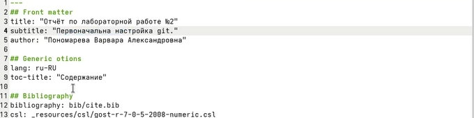
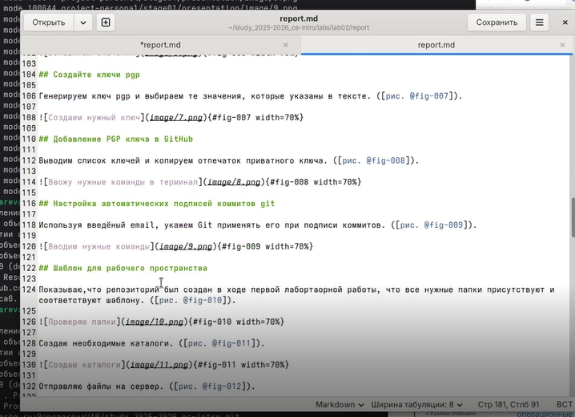
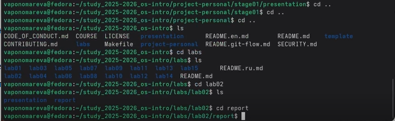
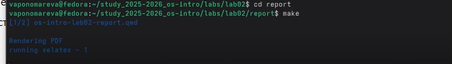

---
## Author
author:
  name: Пономарева Варвара Александровна
  degrees: DSc
  orcid: 0000-0002-0877-7063
  affiliation:
    - name: Российский университет дружбы народов
      country: Российская Федерация
      postal-code: 117198
      city: Москва
      address: ул. Миклухо-Маклая, д. 6
## Title
title: Лабораторная работа №3. Markdown.
license: CC BY
date: today
date-format: "YYYY-MM-DD" # Example: 2025-09-06

## Fonts
mainfont: Liberation Serif
sansfont: Liberation Sans
monofont: Liberation Mono
mainfontoptions: Ligatures=TeX
romanfontoptions: Ligatures=TeX
sansfontoptions: Ligatures=TeX,Scale=MatchLowercase
monofontoptions: Scale=MatchLowercase,Scale=0.9
---

# Информация

## Докладчик

:::::::::::::: {.columns align=center}
::: {.column width="70%"}

  * Пономарева Варвара Александровна
  * студентка группы НПИ бд-02-25

:::
::: {.column width="30%"}

:::
::::::::::::::

# Цель работы

- Научиться оформлять отчёты с помощью легковесного языка разметки Markdown.

# Задание

- Сделайте отчёт по предыдущей лабораторной работе в формате Markdown.

# Изменяю задание для лабораторной работы

## Рис.1

- Изменяем номер лабороторной работы и ее название

## Рис.2

- Изменяю цель работы

## Рис.3

- Изменяю задание для лабораторной работы

# Заполнение отчета

## Рис.4

- Меняю подписи к картинкам, оставляю только нужно количество и проверяю синтаксис

## Рис.5

- Отвечаю на контрольные вопросы и записываю ответ

# Компиляция отчета

## Рис.6

- Перехожу в нужную папку с лабораторной работой

## Рис.7

- Компилирую отчет с помощью команды make

## Рис.8

- Проверяю отчет на наличие ошибок

# Выводы

- Мы научились оформлять отчёты с помощью легковесного языка разметки Markdown

