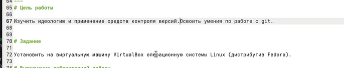
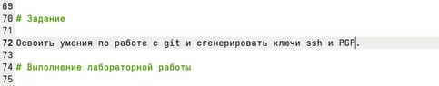
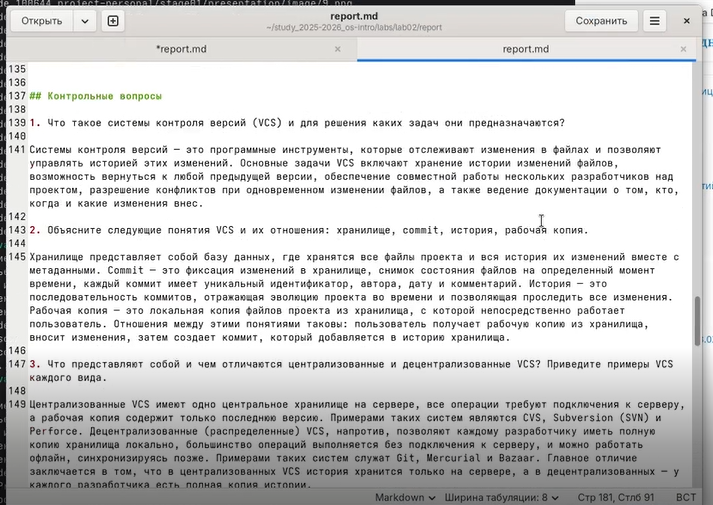
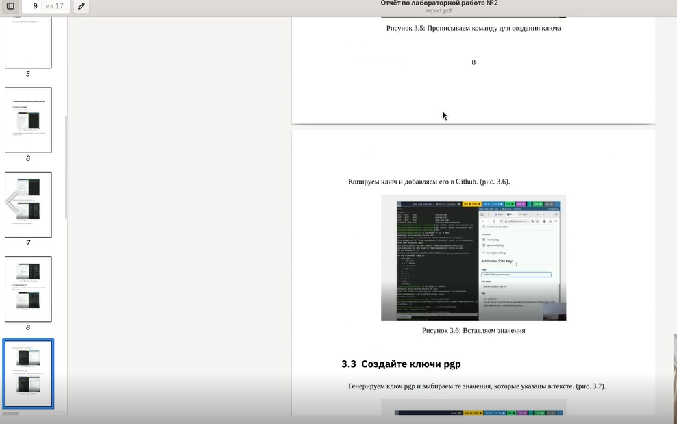

---
## Front matter
title: "Отчёт по лабораторной работе №3"
subtitle: "Markdown"
author: "Пономарева Варвара Александровна"

## Generic otions
lang: ru-RU
toc-title: "Содержание"

## Bibliography
bibliography: bib/cite.bib
csl: _resources/csl/gost-r-7-0-5-2008-numeric.csl

## Pdf output format
toc: true # Table of contents
toc-depth: 2
lof: true # List of figures
lot: false
fontsize: 12pt
linestretch: 1.5
papersize: a4
documentclass: scrreprt
## I18n polyglossia
polyglossia-lang:
  name: russian
  options:
   - spelling=modern
   - babelshorthands=true
polyglossia-otherlangs:
  name: english
## I18n babel
babel-lang: russian
babel-otherlangs: english
## Fonts
mainfont: Liberation Serif
sansfont: Liberation Sans
monofont: Liberation Mono
mainfontoptions: Ligatures=TeX
romanfontoptions: Ligatures=TeX
sansfontoptions: Ligatures=TeX,Scale=MatchLowercase
monofontoptions: Scale=MatchLowercase,Scale=0.9
## Biblatex
biblatex: true
biblio-style: "gost-numeric"
biblatexoptions:
  - parentracker=true
  - backend=biber
  - hyperref=auto
  - language=auto
  - autolang=other*
  - citestyle=gost-numeric
## Pandoc-crossref LaTeX customization
figureTitle: "Рис."
listingTitle: "Листинг"
lofTitle: "Список иллюстраций"
lolTitle: "Листинги"
## Misc options
indent: true
header-includes:
  - \usepackage{indentfirst}
  - \usepackage{float} # keep figures where there are in the text
  - \floatplacement{figure}{H} # keep figures where there are in the text
---
# Цель работы

Научиться оформлять отчёты с помощью легковесного языка разметки Markdown.

# Задание

Сделайте отчёт по предыдущей лабораторной работе в формате Markdown.

# Выполнение лабораторной работы

## Изменение цели работы и задания

Изменяем номер лабороторной работы и ее название. ([рис. @fig-001]).

{#fig-001 width=70%}

Изменяю цель работы. ([рис. @fig-002]).

{#fig-002 width=70%}

Изменяю задание для лабораторной работы. ([рис. @fig-003]).

{#fig-003 width=70%}

## Заполнение отчета

Меняю подписи к картинкам, оставляю только нужно количество и проверяю синтаксис. ([рис. @fig-004]).

{#fig-004 width=70%}

Отвечаю на контрольные вопросы и записываю ответ. ([рис. @fig-005]).

{#fig-005 width=70%}

## Комплиляция отчета

Перехожу в нужную папку с лабораторной работой. ([рис. @fig-006]).

{#fig-006 width=70%}

Компилирую отчет с помощью команды make. ([рис. @fig-007]).

{#fig-007 width=70%}

Проверяю отчет на наличие ошибок. ([рис. @fig-008]).

{#fig-008 width=70%}

# Выводы

Мы научились оформлять отчёты с помощью легковесного языка разметки Markdown.
