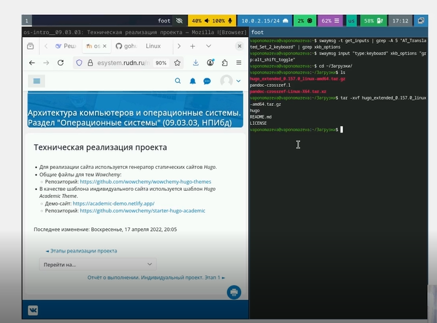
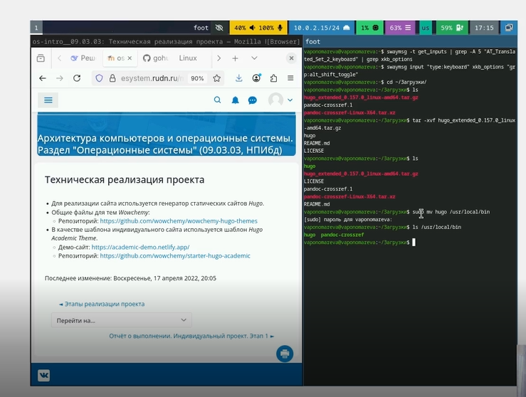
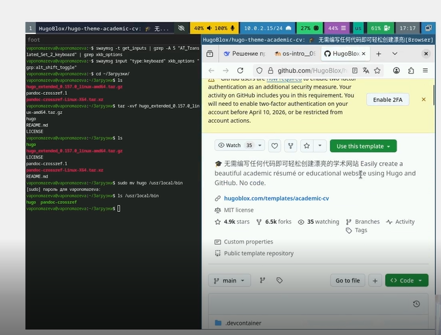
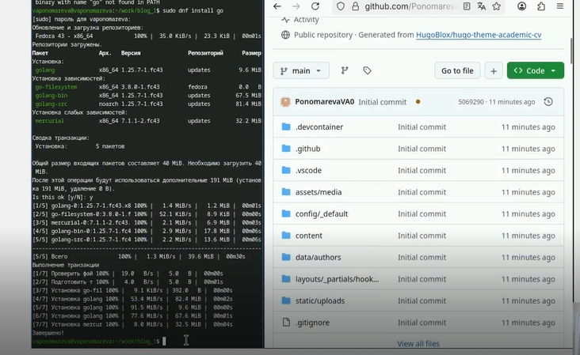
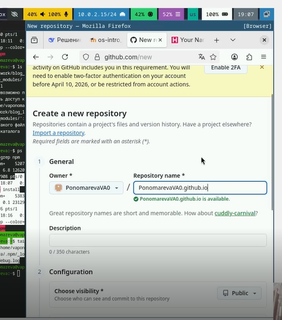

---
## Author
author:
  name: Пономарева Варвара Александровна
  degrees: DSc
  orcid: 0000-0002-0877-7063
  affiliation:
    - name: Российский университет дружбы народов
      country: Российская Федерация
      postal-code: 117198
      city: Москва
      address: ул. Миклухо-Маклая, д. 6
## Title
title: Первый этап индивидуального проекта
license: CC BY
date: today
date-format: "YYYY-MM-DD" # Example: 2025-09-06

## Fonts
mainfont: Liberation Serif
sansfont: Liberation Sans
monofont: Liberation Mono
mainfontoptions: Ligatures=TeX
romanfontoptions: Ligatures=TeX
sansfontoptions: Ligatures=TeX,Scale=MatchLowercase
monofontoptions: Scale=MatchLowercase,Scale=0.9
---

# Информация

## Докладчик

:::::::::::::: {.columns align=center}
::: {.column width="70%"}

  * Пономарева Варвара Александровна
  * студентка группы НПИ бд-02-25

:::
::: {.column width="30%"}

:::
::::::::::::::

# Цель работы

- Целью данной работы является установка необходимого ПО, а также размещение заготовки сайта на Github pages.

# Задание

- Установить необходимое программное обеспечение. Скачать шаблон темы сайта. Разместить его на хостинге git. Установить параметр для URLs сайта. Разместить заготовку сайта на Github pages.

# Установка Hugo

## Рис.1

- Для создания сайта нам понадобится генератор статических сайтов Hugo. На странице релизов проекта находим нужную версию для операционной системы Linux

## Рис.2

- Прописываем нужную команду tar -xvf

## Рис.3

- Перемещаем распакованные файлы в нужную папку с помошью mv

## Рис.4

- Переходим по ссылке на репозиторий в туис

# Создание репозитория

## Рис.5

- Используем этот репозиторий чтобы на основе него создать свой

## Рис.6

- Копируем репозиторий на пк с помощью git clone и  ssh

# Настройка окружения

## Рис.7

- Устанавливаем go с помощью sudo dnf

## Рис.8

- Запускаем hugo server чтобы посмотреть шаблон сайта

## Рис.9

- Переходим по появившейся ссылке и изучаем шаблон

# Создание сайта по шаблону

## Рис.10

- Создаем новый репозиторий с именем PonomarevaVAO.github.io, который будет использоваться для публикации на Github Pages

## Рис.11

- Клонируем свежесозданный репозиторий и переключаемся на ветку main

## Рис.12

- Создаем файл README.md для описания репозитория

## Рис.13

- Устанавливаем сабмодуль для папки паблик

## Рис.14

- Добавляем файл в отслеживание, создаем коммит и отправляем изменения на GitHub

## Рис.15

- Переходим по ссылке нашего сайта и смотрим что все в порядке

# Выводы

- В ходе выполнения первого этапа индивидуального проекта было установлено необходимое программное обеспечение, включая генератор статических сайтов Hugo и компилятор Go. Были созданы два репозитория: blog_1 для исходных файлов сайта и PonomarevaVAO.github.io для публикации на Github Pages. Освоены навыки работы с удаленными репозиториями через SSH, выполнена базовая настройка структуры сайта. Таким образом, создана основа для дальнейшей работы над индивидуальным сайтом.

