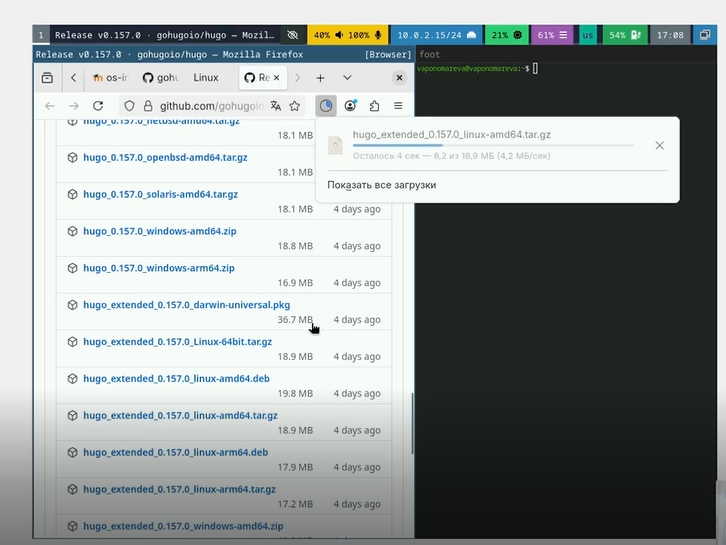
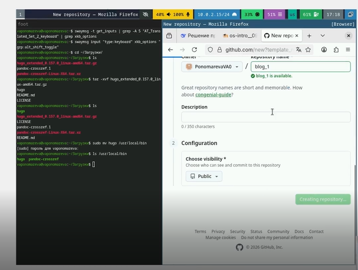
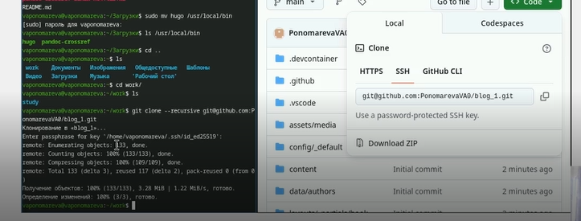
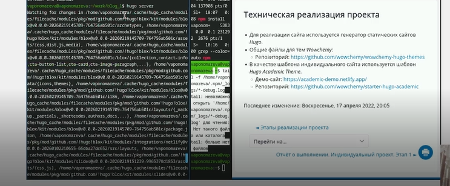
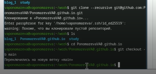
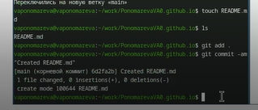
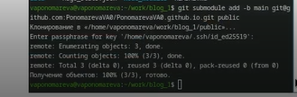
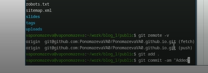
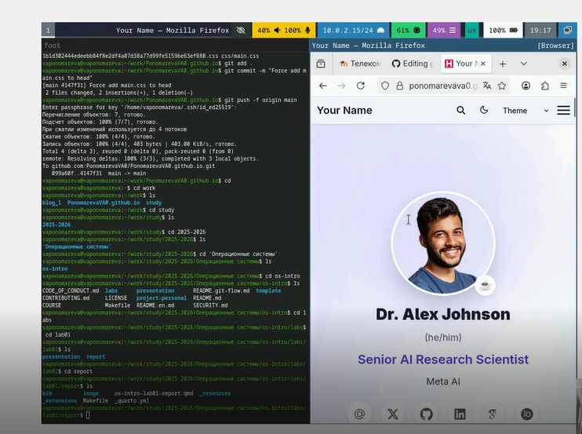

---
## Front matter
title: "Отчет по выполнению первого этапа индивидуального проекта"
subtitle: "Первый этап"
author: "Пономарева Варвара Александровна"

## Generic otions
lang: ru-RU
toc-title: "Содержание"

## Bibliography
bibliography: bib/cite.bib
csl: _resources/csl/gost-r-7-0-5-2008-numeric.csl

## Pdf output format
toc: true # Table of contents
toc-depth: 2
lof: true # List of figures
lot: false
fontsize: 12pt
linestretch: 1.5
papersize: a4
documentclass: scrreprt
## I18n polyglossia
polyglossia-lang:
  name: russian
  options:
   - spelling=modern
   - babelshorthands=true
polyglossia-otherlangs:
  name: english
## I18n babel
babel-lang: russian
babel-otherlangs: english
## Fonts
mainfont: Liberation Serif
sansfont: Liberation Sans
monofont: Liberation Mono
mainfontoptions: Ligatures=TeX
romanfontoptions: Ligatures=TeX
sansfontoptions: Ligatures=TeX,Scale=MatchLowercase
monofontoptions: Scale=MatchLowercase,Scale=0.9
## Biblatex
biblatex: true
biblio-style: "gost-numeric"
biblatexoptions:
  - parentracker=true
  - backend=biber
  - hyperref=auto
  - language=auto
  - autolang=other*
  - citestyle=gost-numeric
## Pandoc-crossref LaTeX customization
figureTitle: "Рис."
listingTitle: "Листинг"
lofTitle: "Список иллюстраций"
lolTitle: "Листинги"
## Misc options
indent: true
header-includes:
  - \usepackage{indentfirst}
  - \usepackage{float} # keep figures where there are in the text
  - \floatplacement{figure}{H} # keep figures where there are in the text
---
# Цель работы

Целью данной работы является установка необходимого ПО, а также размещение заготовки сайта на Github pages.

# Задание

Установить необходимое программное обеспечение. Скачать шаблон темы сайта. Разместить его на хостинге git. Установить параметр для URLs сайта. Разместить заготовку сайта на Github pages.

# Выполнение индивидуального проекта

## Установка Hugo

Для создания сайта нам понадобится генератор статических сайтов Hugo. На странице релизов проекта находим нужную версию для операционной системы Linux. ([рис. @fig-001]).

{#fig-001 width=70%}

Прописываем нужную команду tar -xvf. ([рис. @fig-002]).

{#fig-002 width=70%}

Перемещаем распакованные файлы в нужную папку с помошью mv. ([рис. @fig-003]).

{#fig-003 width=70%}

Переходим по ссылке на репозиторий в туис. ([рис. @fig-004]).

{#fig-004 width=70%}

## Создание репозитория

Используем этот репозиторий чтобы на основе него создать свой. ([рис. @fig-005]).

{#fig-005 width=70%}

Копируем репозиторий на пк с помощью git clone и  ssh. ([рис. @fig-006]).

{#fig-006 width=70%}

## Настройка окружения

Устанавливаем go с помощью sudo dnf. ([рис. @fig-007]).

{#fig-007 width=70%}

Запускаем hugo server чтобы посмотреть шаблон сайта. ([рис. @fig-008]).

{#fig-008 width=70%}

Переходим по появившейся ссылке и изучаем шаблон. ([рис. @fig-009]).

{#fig-009 width=70%}

## Создание сайта по шаблону

Создаем новый репозиторий с именем PonomarevaVAO.github.io, который будет использоваться для публикации на Github Pages. ([рис. @fig-010]).

{#fig-010 width=70%}

Клонируем свежесозданный репозиторий и переключаемся на ветку main. ([рис. @fig-011]).

{#fig-011 width=70%}

Создаем файл README.md для описания репозитория.. ([рис. @fig-012]).

{#fig-012 width=70%}

Устанавливаем сабмодуль для папки паблик. ([рис. @fig-013]).

{#fig-013 width=70%}

Добавляем файл в отслеживание, создаем коммит и отправляем изменения на GitHub. ([рис. @fig-014]).

{#fig-014 width=70%}

Переходим по ссылке нашего сайта и смотрим что все в порядке. ([рис. @fig-015]).

{#fig-015 width=70%}

# Выводы

В ходе выполнения первого этапа индивидуального проекта было установлено необходимое программное обеспечение, включая генератор статических сайтов Hugo и компилятор Go. Были созданы два репозитория: blog_1 для исходных файлов сайта и PonomarevaVAO.github.io для публикации на Github Pages. Освоены навыки работы с удаленными репозиториями через SSH, выполнена базовая настройка структуры сайта. Таким образом, создана основа для дальнейшей работы над индивидуальным сайтом.
